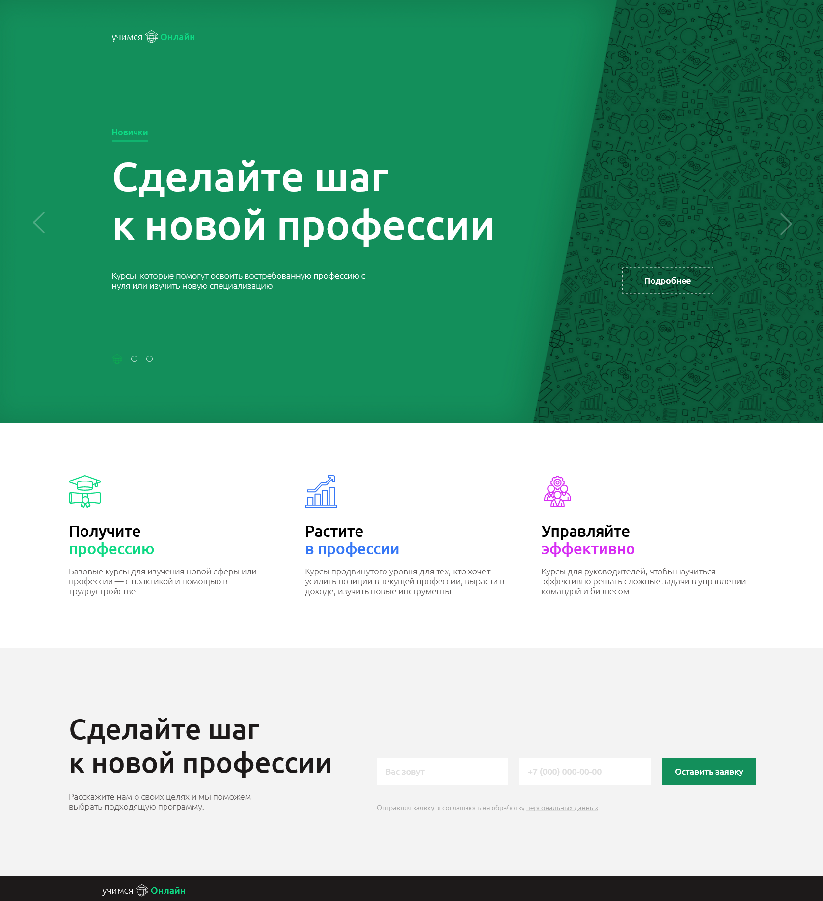

# Задание по вёрстке (DY)

## Содержимое

- [Обзор](#обзор)
  - [Скриншот](#скриншот)
  - [Ссылки](#ссылки)
- [Что и как?](#что-и-как?)
  - [Сделано с использованием](#сделано-с-использованием)

## Обзор

### Скриншот

### Ссылки

- Хостинг: [https://tangerine-rolypoly-edc006.netlify.app/](https://tangerine-rolypoly-edc006.netlify.app/)

## Что и как?

### Сделано с использованием

- HTML5
- CSS
- JavaScript
